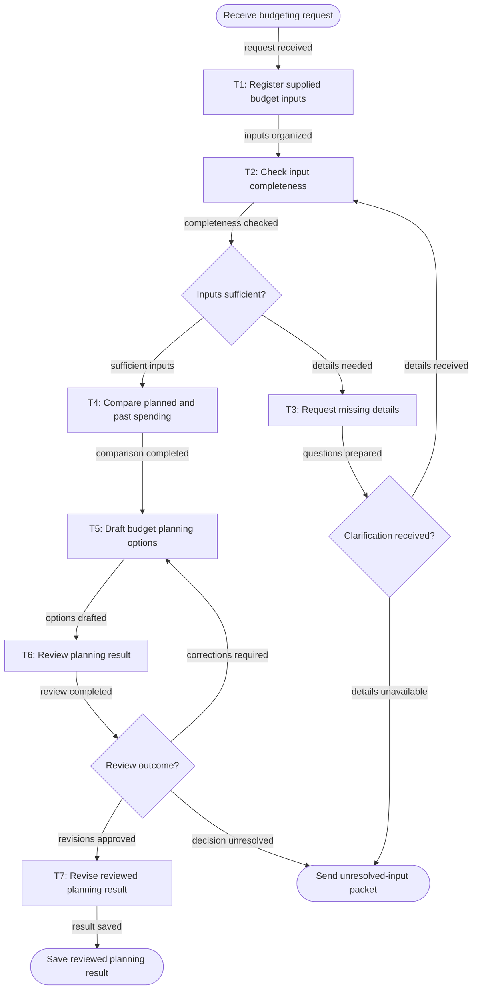

# Workflow of Tasks

## 1. Workflow Goal

This workflow supports the goal in our completed [team charter](https://github.com/KeanuWidjaja/BUS4498_Team_Build/blob/main/README.md). The workflow coordinates Register supplied budget inputs, Check input completeness, Compare planned and past spending, Draft budget planning options, Review planning result, Revise reviewed planning result, Request missing details. Its intended result is: A reviewed budget-planning result is saved or otherwise made available to the requester, with documented assumptions, identified gaps, and any requested clarification resolved or noted.

## 2. Workflow Trigger

A requester supplies a budget-planning request with any available funds, spending, event, category, or priority information for one planning cycle.

## 3. Completion Condition at Runtime

A reviewed budget-planning result is saved or otherwise made available to the requester, with documented assumptions, identified gaps, and any requested clarification resolved or noted.

## 4. General Workflow

The workflow starts when A requester supplies a budget-planning request with any available funds, spending, event, category, or priority information for one planning cycle..

T1 · Register supplied budget inputs: Organize the supplied request and any stated available funds, planned spending, past spending, event needs, categories, and priorities into a traceable planning-input set. T2 · Check input completeness: Check whether the supplied information is sufficient to distinguish available funds, intended spending, prior spending where provided, and requester priorities; identify omissions or ambiguities without filling them with unsupported values. T4 · Compare planned and past spending: Analyze supplied planned and historical spending by relevant category or activity, identify material gaps or changing-cost considerations supported by the records, and keep estimates clearly labelled as estimates. T5 · Draft budget planning options: Create planning options that reflect supplied funds and priorities, show assumptions and trade-offs, and avoid making purchases, transfers, guarantees, or priority decisions on the requester’s behalf. T6 · Review planning result: Have a human review the draft for input fidelity, arithmetic or interpretation concerns, transparent assumptions, and alignment with requester-stated priorities; identify required corrections or unresolved decisions. T7 · Revise reviewed planning result: Apply review-approved corrections, preserve unresolved items and assumptions, and prepare the reviewed planning result for release to the requester. T3 · Request missing details: Prepare focused clarification questions for missing, conflicting, or unclear budget inputs and record the response when it is supplied.

Task connections: START → T1 (request received); T1 → T2 (inputs organized); T2 → D1 (completeness checked); T3 → D2 (questions prepared); T4 → T5 (comparison completed); T5 → T6 (options drafted); T6 → D3 (review completed); T7 → END (result saved).

Routing: Inputs sufficient? — sufficient inputs → T4 · Compare planned and past spending; details needed → T3 · Request missing details. Review outcome? — revisions approved → T7 · Revise reviewed planning result; corrections required → T5 · Draft budget planning options; decision unresolved → HANDOFF · Send unresolved-input packet. Clarification received? — details received → T2 · Check input completeness; details unavailable → HANDOFF · Send unresolved-input packet.

T6 · Review planning result is performed by Nathan Chen. Required input: 

Stopped cases: Work stops when required information or decisions remain unavailable; send the request, supplied records, missing-input list, and review notes to the proposed requester or organization budget lead..

Exception and handoff instructions: T1: Flag and preserve the missing or invalid input, then route it to T2 · Check input completeness. T2 identifies the clarification needed for T3 · Request missing details, which asks the requester to supply or correct the information. Do not invent replacement values T1: Record the failure status, request identifier, attempt count, and error details. Preserve the original inputs and any partial output, marked incomplete. Route the exception to the requester, such as the organization’s treasurer or authorized event organizer, for review. T2: f the record is absent or unreadable, return it to T1 for correction. If the record is readable but contains missing, conflicting, or unclear budget details, identify those gaps and route them to T3 · Request missing details. T2: Record the failure status, request identifier, attempt count, and error details. Preserve the inputs and mark any partial assessment incomplete. Route the exception to the requester, such as the organization’s treasurer or authorized event organizer, for review. T4: : Required source evidence cannot be accessed or traced, further examination makes no progress, a non-retryable error occurs, or resolving a finding requires authority outside the task. Stop when either 3 tool calls or 200 seconds is reached. Ordinary missing budget details route to T3 for clarification. T4: The organization’s treasurer or authorized event organizer. Preserve the inputs, findings, and failure evidence, record unresolved status, and take no further autonomous action while awaiting review.

## 5. Workflow Diagram

